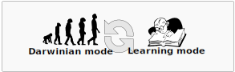

.. The XLEMOO framework documentation master file, created by
   sphinx-quickstart on Mon Nov 21 16:43:19 2022.
   You can adapt this file completely to your liking, but it should at least
   contain the root `toctree` directive.

Welcome to The XLEMOO framework's documentation!
================================================

.. toctree::
   :maxdepth: 1
   :caption: The XLEMOO framework

   introduction

.. toctree::
   :maxdepth: 1
   :caption: Notebooks

   notebooks_section

.. toctree::
   :maxdepth: 1
   :caption: API documentation 

   api

Indices and tables
==================

* :ref:`genindex`
* :ref:`modindex`
* :ref:`search`
