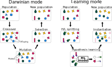

Introduction: what is XLEMOO?
=============================

.. note::

    The reader is assumed to be familiar with the basic concepts of multiobjective optimization.

XLEMOO (*Explainable learnable multiobjective optimization*) is a Python framework
for evolutionary multiobjective optimization enhanced with machine learning. The core idea
is to utilize both Darwinian inspired evolutionary algorithms and interpretable machine learning models together to
find a population of near-Pareto optimal solutions to a multiobjective optimization problem.
This combination of evolutionary algorithms and machine learning gives raise to two modes:
a *Darwininan mode* and a *learning mode*. These modes have been illustrated in :ref:`Figure 1<modes>`.

.. _modes:

    Figure 1: A Darwinian and learning mode depicted. From [Misitano2023a]_.

In utilizing interpretable machine learning models, we have the ability to build a rudimentary understanding
on what kind of solutions in a population are *good* and what kind are less good. In practice, this means
finding what kind of decision variables are needed to produce near-Pareto optimal solutions.
This understanding gives raise to the explainable nature of the XLEMOO approach.

For futher details and a more in-depth description of the XLEMOO approach, please see [Misitano2023a]_.

Getting started
===============

In this section, instuctions are given to install the XLEMOO frameowrk and verify it is working.

.. note::

    These instructions have been verified to work on a Linux-based operating system. They should
    apply to other \*nix systems as well and Windows.

    Tools required to install the frameowrk according to the current documentation are 
    `git`_, `Poetry`_, and Python version 3.9 or 3.10.
    It is highly advised that users utilize Poetry to install the framework.

Installation
------------

Begin by cloning the XLEMOO repository and chaning changing the workind directory to the root of the repository:

.. code-block:: shell

    $ git clone https://github.com/gialmisi/XLEMOO
    $ cd XLEMOO

Next, create a new virtual environment with poetry and switch to it:

.. code-block:: shell

    $ poetry shell

Then, install the frameowork with the command:

.. code-block:: shell

    $ poetry install

or with development dependencies included:

.. code-block:: shell

    $ poetry install --with dev

The XLEMOO framework should now be installed locally on your machine. 

Tests
-----

XLEMOO utilized `pytest`_ for unit testing, which is included in the development dependencies. Before continuing,
make sure development dependencies are installed:

.. code-block:: shell

    $ poetry install --with dev

To run the unit tests, run:

.. code-block:: shell

    $ pytest --reruns 5

.. note::

    The ``--reruns 5`` options is used to ensure that some tests are run multiple times in case of failure. Because
    of the heuristic nature of some computations, all tests may not always pass due to some numerical checks.
    This is expected.

If everything is working as expected, the tests should all pass with no errors (some warnings are expected).

Next steps
----------

The XLEMOO framework should now be fully functional and the reader is welcome to utilize the framework however they like.
Below are a couple of suggestions for next steps from here:

- An usage example of the XLEMOO framework is given in :ref:`Notebooks<notebooks>`.
- How to use and start modifying the framework is briefly discussed in :ref:`Basic usage<hacking>`.
- Steps to reproduce the numerical experimetns in [Misitano2023a]_ are presented in :ref:`Reproducibility<repro>`.
- The :ref:`API documentation<apidocs>` provides more documentation on the specific parts of the code found in the framework. 

.. _repro:

Reproducibility
===============

.. warning::

    Because of the heuristic nature of the XLEMOO algorithms, the exact same results shown in the article
    might be impossible to reproduce with 100% accuracy. However, results, expecially the statistical ones,
    should be close to what was originally reported. The data ([Misitano2023b]_)
    referred to at the end of this Section is
    the original data used in [Misitano2023a]_ and will produce the same plots heatmap and line plots
    show in [Misitano2023a]_.

In this section, the steps required to reproduce the main experimental results in [Misitano2023a]_ (referred to as
*the article* in this section) will be presented.

Requirements
------------

`snakemake`_ is the main tools utilized for enable the reproducible workflow of the experiments discussed
in the article.

.. note::

    The reader is assumed to have an intermediate knowledge of the Python programming language and
    be familiar with the basic usage of snakemake.

Example
-------

An example is provided in this section to repdoduce the data for the *vehicle crash worthiness problem*.
To begin, make sure the development dependencies of the XLMEOO framework have been installed:

.. code-block:: shell

    $ poetry install --with dev

This ensures the installation of snakemake and other tools needed to run the experiments.

In the ``Snakefile`` found at the root of the XLMEOO repository, there are three rules that will be important:

- ``rule all_parameters_experiment``: used to run the experiments to produce the raw numerical data;
- ``rule all_statistics``: utilizes the raw numerical data, statistics are computed; and
- ``rule all_heatmaps``: produces the heatmaps shown in the article.

The above rules will automatically run multiple sub-rules with different parameter configurations.

For the line plots in the article, the file ``plot_many_per_frequency.py`` in the ``XLEMOO/scripts`` directory has been used.
This script relies on the statistics produced by the ``all_statistics`` rule defined in the Snakefile.

The parameters used in the rules defined in the Snakefile are set in the ``experiments.yaml`` file at the root
of the XLEMOO project. In the file, make sure under ``# problem conf`` the parameters related to the
``vehicle crash worthiness`` problem are uncommented. The paramters for the other two problems should be commented
(``multiple clutch brakes`` and ``carside impact problem``).

To reproduce the raw numerical data and statistical data, run the following command:

.. code-block:: shell

    $ snakemake --cores 4 all_statistics -k --retries 100

The ``--cores`` parameter may be adjusted to match the number of available cores on your machine; the ``-k``
parameter tells snakemake to continue executing the rules even if a previous rule fails; and the ``--retries 100``
parameter tells snakemake to retry failed rules at least 100 times before giving up.

.. note::

    Due to the heuristic nature of the experiments, some rules may fail multiple times. A 100 retries may be not enough.
    In case some rules do not get executed, then rerunning the above command will retry the failed rules at least a 100
    times before giving up. Failing to execute some rules is expected behavior.
    
After the statistical data has been produced succesfully (all sub-rules have been executed without errors),
the heatmaps may be generated utilizing the command:

.. code-block:: shell
    
    $ snakemake --cores 4 all_heatmaps

which will produce the heatmaps shown in the article.

To produce the line plots in the article, the script ``plot_many_per_frequency.py`` can be run. In the script,
at the top, make sure the ``data_dir`` and ``problem_name`` are correctly set.

For an example on how the histograms present in the article have been generated, see
:doc:`this example notebook <notebooks/How_to_extract_rules_example>`.

Archived experiment data
------------------------

The data used to produce the results in the article ([Misitano2023a]_) have also been stored on
Zenodo ([Misitano2023b]_). This includes the
raw numerical data and the statistical data.

.. _hacking:

Basic usage
===========

.. note::

    Before proceeding, it
    is highly suggested to first read [Misitano2023a]_ to gain a good undertsanding of the basic idea
    of the algorithms implemented in the XLEMOO framework.

The XLEMOO framework can be modified to many different extents.
In this section, the basic functionality of the algorithm implemented in the framework is described.

To get started, it is good to first
understand the basic flow of the main algorithm implemented in the :class:`LEMOO <XLEMOO.LEMOO.LEMOO>` class,
which is illustrated in :ref:`Figure 2<flow>`. The XLEMOO frameowrk makes use of the population
class defined in the ``desdeo-emo`` module of the DESDEO framework [Misitano2021]_.
The documentation of ``desdeo-emo`` is available `here <emo_>`_. 

.. _flow:

    Figure 2: The basic flow of the algorithm implemented in the LEMOO class. From [Misitano2023a]_.

The :class:`LEMOO <XLEMOO.LEMOO.LEMOO>` class takes many paramters, which are documented in the
:ref:`API documentation<apidocs>`. These are:

- :class:`EAParams <XLEMOO.LEMOO.EAParams>`: Parameters related to the evolutionary algorithm used in the Darwininan mode.
- :class:`MLParams <XLEMOO.LEMOO.MLParams>`: Parameters related to the machine learning model used in the learning mode.
- :class:`LEMParams <XLEMOO.LEMOO.LEMParams>`: Generic parameters for the learnable evolurionary method.

Currently, a simple indicator based evolurionary multiobjective optimization algorithm has been implemented in 
the XLEMOO framwork. If one wishes to change the Darwinian or learning modes in the algorithm,
the methods :class:`darwininan_mode <XLEMOO.LEMOO.LEMOO.darwininan_mode>` and 
:class:`learning_mode <XLEMOO.LEMOO.LEMOO.learning_mode>` can be modified.

To run the LEMOO method, either execute the method :class:`XLEMOO.LEMOO.LEMOO.run`, which will
utilize treshold values to determine when to switch between modes, or
:class:`XLEMOO.LEMOO.LEMOO.run_iterations`, which will run the LEMOO method for a set number of iterations
in each mode.

To get a solid grasp on how the framework works, it is recommended to check the basic usage example in the
:ref:`Notebooks<notebooks>` section.

Citation
========

If you utilize the XLEMOO frameowork in your own work, it would be greatly appreciated if you cited
the publication [Misitano2023a]_.

References
==========

.. note::

    References will be updated when published.

.. [Misitano2023a]
    Misitano, G.. (2023). Exploring the Explainable Aspects and Performance of a Learnable Evolutionary Multiobjective Optimization Method. ACM Transactions on Evolutionary Learning and Optimization. To be published.

.. [Misitano2023b]
    Misitano, G.. (2023). XLEMOO numerical experiment data. https://doi.org/10.5281/zenodo.8085637 

.. [Misitano2021]
    Misitano, G., Saini, B. S., Afsar, B., Shavazipour, B., & Miettinen, K. (2021). DESDEO: The Modular and Open Source Framework for Interactive Multiobjective Optimization. IEEE Access (Vol. 9, pp. 148277–148295). Institute of Electrical and Electronics Engineers (IEEE). https://doi.org/10.1109/access.2021.3123825 

.. _git: https://git-scm.com/
.. _Poetry: https://python-poetry.org/
.. _pytest: https://docs.pytest.org/en/7.3.x/
.. _snakemake: https://snakemake.readthedocs.io/en/stable/
.. _emo: https://desdeo-emo.readthedocs.io/en/latest/